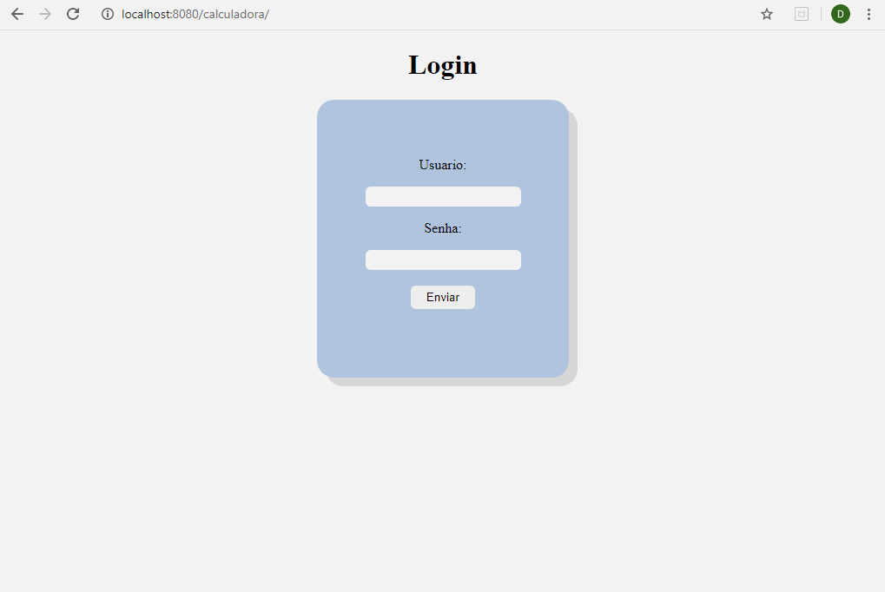

# Calculadora

<h2>Objetivo do projeto</h2>

	Desenvolvimento de uma calculadora navegavel, que é acessivel somente a usuarios logados,as operações são efetuadas no back end que recebe, via requisição AJAX, os 2 operandos e a operação a ser efetuada, retornando o resultado. O usuário poderá acessar seu histórico de operações realizadas. 

Tecnologias:

<ul>
  <li>Java</li>
  <li>Gradle</li>
  <li>Tomcat</li>
</ul>

Disciplina: Laboratorio de Engenharia de Software

